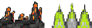
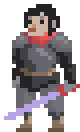
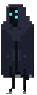

# COMP-2522-Term-Project

Every program needs a README.md

This is written in markdown. Read about markdown here: [markdowncheatsheet](https://www.markdownguide.org/cheat-sheet/)

## Your names:
- Prabhjeet Bains
- Benny Chao

## Your student number:
- A01265942
- A01270575

## Your GitHub account:
- Prab-Bains
- Bnyaoo

## Player Login ##
- Email ID: test@planetbandit.com
- Password: 2522

## Controls:
- Use W, A, S and D to move the character
- Press W key twice to double jump

## Rules:
### Terrain: ###
- Coming in contact with spikes results in the loss of one life.
- 

- Coming in contact with a laser beam results in the loss of one life.
- 

- Jumping on a trampoline launches your character forward to reach otherwise unreachable platforms.
- 

- Temporary platforms allow the player to stand on it momentarily; idling on these platforms usually results in the 
  loss of one life.

- 

- Moving platforms allow the player to automatically bridge gaps between terrain. In later stages, idling on a 
  moving platform may result in the loss of one life.

- 

- Bodies of water, similar to spikes, will result in the loss of a life.

- 

### Objective: ###

- Reach the end of the map and solve the riddle that the fugitive provides to progress to the next stage.

### Fugitives: ###

- Avacyn - The Tarnished
- 

- Geralf - Visionary Stitcher
- 

- Jin - Progress Tyrant
- 

## Any important comments you'd like to make about your work:

## References:
Code:
- https://github.com/AlmasB/FXTutorials/blob/master/src/main/java/com/almasb/invaders/SpaceInvadersApp.java
- https://github.com/AlmasB/FXGLGames/tree/master/Mario
- https://github.com/chris-thompson/2522-202210-JavaFX-Examples.git
- https://github.com/Siderim/video-game-menu/blob/master/Main.java
- https://www.javaguides.net/2019/07/login-form-using-javafx-with-mysql-database.html
- https://github.com/Siderim/video-game-menu/blob/master/Main.java

Artwork, Music, and Other Assets:
- https://opengameart.org/content/animated-warrior
- https://cdnb.artstation.com/p/assets/images/images/029/514/221/large/santiago-banol-yandros-image.jpg?1597790275
- https://i.pinimg.com/474x/1b/cf/e3/1bcfe3609d55b6f5f9f3e753a67a9d5c.jpg
- https://itch.io/queue/c/948368/sci-fi-series?game_id=868076
- https://preview.redd.it/9kqdzxexajn71.png?width=640&crop=smart&auto=webp&s=ecbed1bb2645aad8bbe31382c8a6189b7031a74c
- https://img.freepik.com/free-vector/pixel-art-heart-icon_41992-1611.jpg
- https://www.youtube.com/watch?v=YmbdqcbWgnI
- https://www.youtube.com/watch?v=AgzE2TeXCl0
- https://www.youtube.com/watch?v=QtCbgadN3Rc

### Sprint 1 Comments:
- We were unable to get the asteroids in the space invader mini-game working properly, but we did complete many other
  things that we did not plan to finish in sprint 1 to make up for it.
- We need to match up our frame sizes to make the space mini-game "part of" the actual game
- We still have a lot of commenting left to do because we spent very long trying to get used to javafx and trying to
  get things working
- We currently have 2 different playable classes because we didn't get the chance to merge them into one yet

### Sprint 2 Comments:
- We got almost our entire gameplay complete we just need to link the different components of the game to each other
and incorporate a save method
- We need to add in our riddle system
- We decided to change how the space mini-game works because the actual game itself is hard enough